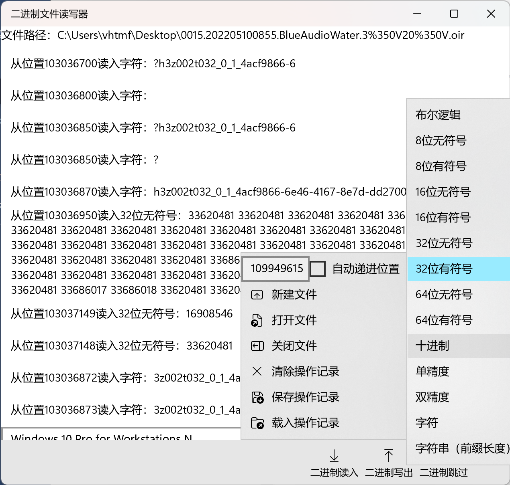

从文件任意字节位置开始，进行二进制读写。支持的数据类型：布尔逻辑、8~64位有无符号整数、十进制、单双精度、字符、32位有符号整数前缀长度的字符串

# 部署方法
最推荐的方法是在 Microsoft Store 中直接搜索“二进制文件读写器”。如果你的操作系统版本不包含 Microsoft Store （如服务器版本），可以在 GitHub Release 中下载旁加载包（Binary-file-IO.zip）。解压后使用PowerShell运行其中的Install.ps1脚本，按提示操作完成安装。
